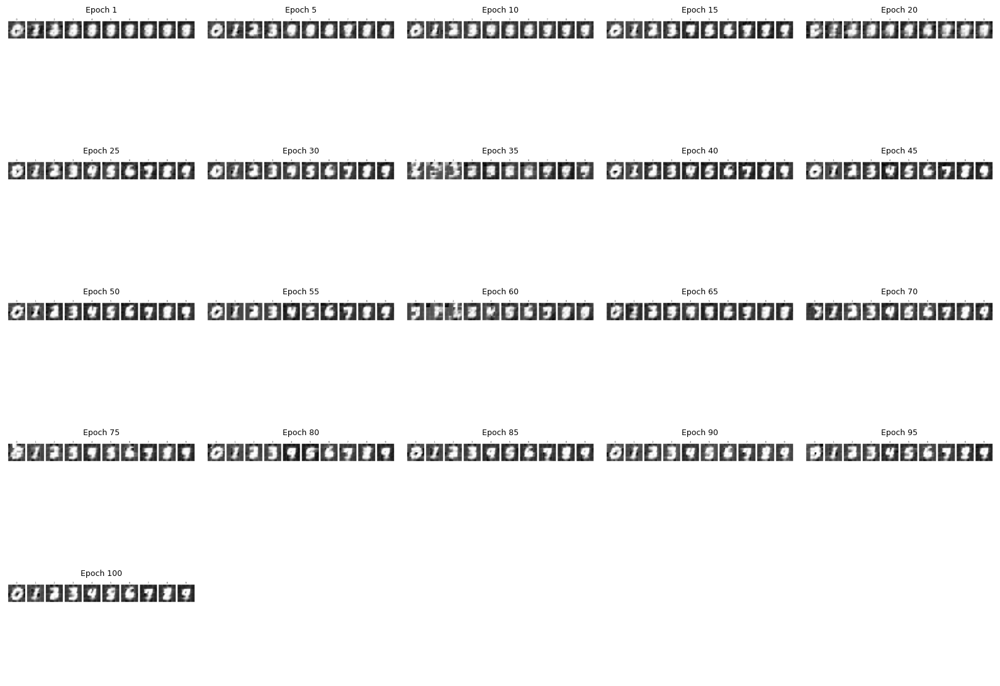
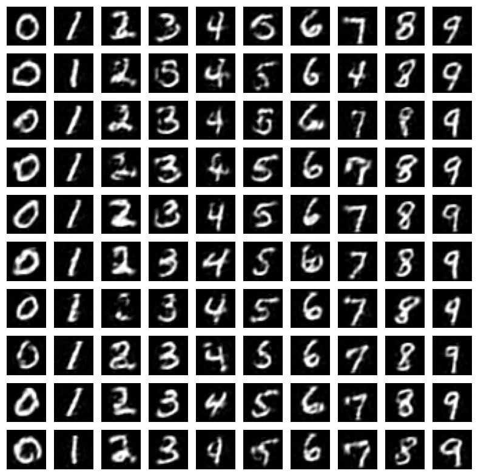

# OdyssNet: The Temporal Revolution

**OdyssNet is the proof that Time is the ultimate Hidden Layer.**

[](LICENSE)
[](https://www.python.org/downloads/)
[](https://github.com/theomgdev/keel)

Traditional Deep Learning relies on **Spatial Depth** (layers stacked on top of each other) to solve complexity. OdyssNet discards this orthodoxy, proving that **Temporal Depth** (chaos evolving over time) is a vastly more efficient substitute.

> **The Zero-Hidden Breakthrough**
>
> In 1969, Minsky & Papert proved that a neural network without hidden layers cannot solve non-linear problems like XOR.
> **OdyssNet has broken this limit.**
>
> By treating the network as a **Trainable Dynamic System**, OdyssNet solves non-linear problems (XOR, MNIST) using **0 Hidden Layers**. It replaces spatial neurons with temporal thinking steps.

OdyssNet achieves its efficiency through **Space-Time Trade-off**. Instead of adding thousands of new neurons (Space) to build depth, it executes existing neurons for more steps (Time). A single physical matrix is reused across temporal steps, folding tens of layers worth of computation into a microscopic parametric footprint. This proves that intelligence is a dynamic process, not a static structure.

> **WORLD RECORD: Parametric Intelligence Density**
>
> OdyssNet reaches **89.89% accuracy** on MNIST with **634 parameters** — 0.14% accuracy per parameter, in a model small enough to print on a business card.

## TL;DR

- OdyssNet replaces spatial depth with temporal depth: one recurrent core "thinks" for multiple steps instead of stacking hidden layers.
- **New in 3.0:** optional multi-head attention over the core's own state history — with a real KV cache — attached along time instead of between layers, and off by default.
- It solves non-linear tasks (XOR, MNIST) with **zero hidden layers** via trainable dynamics.
- Achieves **89.89% MNIST accuracy** with **634 parameters**, and **96.05%** on 7x7 MNIST with 4,669.
- **New in 3.1.1:** a *hive*. Eight bodies run the same core with no contact between them — separate states, separate caches, separate forward passes — and share one pooled Hebbian trace. Each is shown one edge of a ring drawn fresh per episode; every body then recalls edges it never observed and composes chains up to four edges long, **1.000 against 0.125 chance**, with no gradient step at run time. Run apart, the same weights on the same inputs fall to chance.
- Demonstrates memory, rhythm, attractor stability, and transferable skills across tasks.
- Start with [examples](examples) for proofs, then use the library API in [odyssnet](odyssnet) for your own workloads.

---

## Key Features

*   **Space-Time Conversion:** Replaces millions of parameters with a few "Thinking Steps".
*   **Layerless Architecture:** A single $N \times N$ matrix. No hidden layers.
*   **Trainable Chaos:** Uses **StepNorm** and **Tanh** to tame chaotic signals.
*   **Temporal Attention (3.0):** Optional multi-head attention over the core's *own state history* (`attn_heads=4`) — no layers to stack it between, so it attends along time. Modern KV caching throughout: grouped-query heads, RoPE, a sliding window, and a preallocated ring buffer for allocation-free decoding. Its output projection starts at zero, so switching it on changes nothing until training says otherwise.
*   **Heterogeneous Synaptic Plasticity:** Optional online Hebbian learning (`hebb_type='temporal'|'spatial'|'both'`, `hebb_res='neuron'|'global'`) — the network accumulates correlations *per example* and learns *how fast to learn* via fully differentiable logit parameters (`t_hebb_factor`, `s_hebb_decay`, etc.). The plastic contribution is scaled by a zero-initialized gain, so switching it on changes nothing until training decides otherwise — which makes `hebb_type` an exact control. The trace is kept as the writes it is made of rather than as a matrix, so it costs `steps x batch x N` and never assembles one. Ablate it: measured, it helps on sequential tasks and hurts where attention already covers the same ground.
*   **Collective Memory Across Bodies:** The persistent Hebbian buffer holds the batch mean of the live traces and is handed back to every row on the next call, so a batch can be run as a *colony* — independent bodies with private inputs and outputs, one shared memory living on the core. What one body learns at run time (no gradient, no weight update) every other body can read, including a body built after the fact. Measured in `convergence_hive_mind.py`.
*   **Skill Transfer via Transplantation:** Learned temporal skills can be transplanted across model sizes and re-used in new tasks.
*   **Living Dynamics:** Demonstrates **Willpower** (Latch), **Rhythm** (Stopwatch), and **Resonance** (Sine Wave).

## The Evidence: Zero-Hidden Benchmarks

We pushed OdyssNet to the theoretical limit: **Zero Hidden Neurons**.
In these tests, the Input Layer is directly connected to the Output Layer (and itself). There are no buffer layers.

| Task | Traditional Constraint | OdyssNet Solution | Result | Script |
| :--- | :--- | :--- | :--- | :--- |
| **Identity** | Trivial | **Atomic Unit** | Loss: 0.0 | `convergence_identity.py` |
| **XOR** | Needs Hidden Layer | **Chaos Gate** (Time-folded) | **Solved (3 Neurons)** | `convergence_gates.py` |
| **MNIST** | Needs Hidden Layer | **Zero-Hidden** | **Acc: 98.71%** | `convergence_mnist.py` |
| **MNIST (8k)**| Needs Hidden Layer | **Embedded Challenge** | **Acc: 93.71%** | `convergence_mnist_embed.py` |
| **MNIST (Record)**| Needs Hidden Layer | **634-Param Core + Attention** | **Acc: 89.89%** | `convergence_mnist_record.py` |
| **MNIST Reverse (Generation)** | Needs Decoder | **728-Param Generator** | **90.71% Compression** | `convergence_mnist_reverse_record.py` |
| **Sine Wave** | Needs Oscillator | **Programmable VCO** | **Perfect Sync** | `convergence_sine_wave.py` |
| **Latch** | Needs LSTM | **Attractor Basin** (Willpower) | **Infinite Hold** | `convergence_latch.py` |
| **Stopwatch**| Needs Clock | **Internal Rhythm** | **Error: 0** | `convergence_stopwatch.py` |
| **Detective**| Needs Memory | **Cognitive Silence** (Reasoning) | **Perfect Detect**| `convergence_detective_thinking.py` |
| **Skill Transfer**| Needs Re-Training | **Add -> Multiply Transplant** | **1.7x Lower Final Loss** | `convergence_skill_transfer.py` |
| **Hive Mind**| Needs Re-Training to Share | **Pooled Plastic Trace** (Collective Memory) | **1.000 on Facts No Body Saw** (chance 0.125) | `convergence_hive_mind.py` |
| **Image Diffusion** | Needs a UNet + VAE | **573k-Param Denoiser** (trajectory memory) | **~86% Class Fidelity in 15 min** | `experiment_diffusion.py` |

### The MNIST Zero-Hidden Miracle
Standard Neural Networks require **Hidden Layers** to solve MNIST or XOR. A direct connection (Linear Model) cannot capture the complexity and fails (stuck at ~92%).

OdyssNet solves full-scale MNIST (28x28) with **Zero Hidden Layers** (Direct Input-Output).
*   **Inputs:** 784
*   **Outputs:** 10
*   **Hidden Layers:** **0**
*   **Thinking Time:** 10 Steps

The input layer "talks to itself" for 10 steps. The chaotic feedback loops extract features (edges, loops) dynamically over time, performing the work of spatial layers. This proves that **Temporal Depth can replace Spatial Depth**.

### One Memory, Many Bodies

Eight bodies share one 21,280-parameter core and touch nothing else: separate hidden states, separate attention caches, separate forward passes, private inputs and private outputs. Each is shown **one edge** of an 8-node ring drawn fresh every episode. Every private carrier is then wiped — state zeroed, attention cache reset — and each body is asked to walk the ring from a query symbol, one echo step per edge.

| 320 queries per column | hop 1 | hop 2 | hop 3 |
| :--- | :--- | :--- | :--- |
| **together**, one shared memory | **1.000** | **1.000** | **1.000** |
| apart, one body alone | 0.297 | 0.134 | 0.094 |
| together, memory blank | 0.147 | 0.141 | 0.112 |

Chance is 0.125. Hop 1 is an edge another body observed; hops 2 and 3 compose edges held by different bodies, which no body could answer from its own inputs. The ring exists only for that episode, so the answer cannot be in the weights, and nothing is trained at run time — the study pass runs under `torch.no_grad()`, leaving the write to the architecture's own plasticity.

The only thing between the bodies is the plastic trace they leave on the shared core, which the library pools as the batch mean. The controls say so from every side: move one body's edge and a *different* body's answer follows it (1.000) while that body run alone answers bit-identically; install another colony's memory and the answers follow *that* ring (1.000); run the bodies apart and pool the memories afterwards and the result matches the batched one to 3.0e-08; with `hebb_type=None` the whole thing sits at chance. Trained to seven hops instead of three, the same colony holds 1.000 through four edges and then falls away (0.884, 0.775, 0.228) — one echo step per edge, so composition depth is temporal depth. Full protocol in **section M**.

---

## Installation & Usage

OdyssNet is designed as a modular PyTorch library.

### Installation

```bash
# Recommended: install in development mode
pip install -e .

# Or install all dependencies (including optional LLM/dev extras)
pip install -r requirements.txt
```

> **Note on CUDA:** The `requirements.txt` points to CUDA 11.8 compatible PyTorch. If you have a newer GPU (RTX 4000/5000), you might need to install PyTorch manually:
> `pip install torch torchvision --index-url https://download.pytorch.org/whl/cu121`

### Quick Start

```python
import torch
from odyssnet import OdyssNet, OdyssNetTrainer, set_seed

# Reproducible results for all examples
set_seed(42)

# Initialize a Zero-Hidden Network
# 1 Input, 1 Output. 
model = OdyssNet(num_neurons=2, input_ids=[0], output_ids=[1], device='cuda')
trainer = OdyssNetTrainer(model, lr=1e-4, device='cuda')

# Train
inputs = torch.randn(100, 1)
trainer.fit(inputs, inputs, epochs=50)
```

#### Initialization Protocols

`weight_init=['quiet', 'resonant', 'quiet', 'zero']` is the default strategy, providing optimal initializations for encoder/decoder, core matrix, memory feedback, and gate parameters respectively. Single string values like `'resonant'` are automatically expanded intelligently.

`activation=['none', 'tanh', 'tanh', 'none']` is the default activation layout. The first 3 entries map to encoder/decoder, core, and memory paths. The 4th slot is reserved for config symmetry.

`gate=None` resolves to the default gate layout `['none', 'none', 'identity']` (encoder/decoder off, core off, memory identity gate on). You can pass `gate='sigmoid'` to gate all branches, `['none', 'none', 'sigmoid']` for memory-only gating, or `['none', 'none', 'none']` to disable all gating.

*   **All Networks (Default Core):**
    *   Use `weight_init='resonant'` and `activation='tanh'`. The core will be placed at the Edge of Chaos (ρ(W) = 1.0) from the start, ensuring signal fidelity across temporal steps.
    *   Bipolar Rademacher skeleton + spectral normalization to ρ = 1.0.
*   **Alternative — Large Networks (>10 Neurons):**
    *   `weight_init='orthogonal'` remains a solid fallback for pure stability.
*   **Alternative — Tiny Networks (<10 Neurons, Logic Gates):**
    *   `weight_init='xavier_uniform'` with `activation='gelu'` if resonant convergence is too slow.
*   **Optional — Parametric Gating:**
    *   Use `gate='sigmoid'` for global gating, or branch-specific lists in `[encoder_decoder, core, memory]` order.
    *   Use `'none'` to disable a branch and `'identity'` for explicit identity gating with learnable parameters.

---

## Architecture Overview

### How It Works: Inside the Storm

OdyssNet is not a feed-forward mechanism; it is a **Resonant Chamber**.

### 1. The Pulse (Input) & The Sequence
In traditional AI, input is often a static snapshot. OdyssNet handles both **Pulses** and **Streams**.
*   **Pulse Mode:** An image hits at $t=0$. The network closes its eyes and processes the ripples (MNIST).
*   **Stream Mode:** Data applies sequentially. The network can "wait" and "think" between events (The Detective).

### 2. The Echo (Internal Loops)
The signal travels from every neuron to every other neuron ($N \times N$).
*   Input neurons effectively become **Hidden Neurons** instantly after the first step.
*   Information reverberates, splits, and collides. A pixel at the top-left interacts with a pixel at the bottom-right through direct connection or intermediate echoes.
*   **Holographic Processing:** The "cat-ness" of an image isn't stored in a specific layer; it emerges from the *interference pattern* of all signals colliding.

### 3. Time-Folding (Computation)
Here lies the magic of **Zero-Hidden** performance.
*   Step 1: Raw signals mix. (Equivalent to Layer 1 of MLP)
*   Step 2: Mixed signals mix again. (Equivalent to Layer 2)
*   Step 15: Highly abstract features emerge. (Equivalent to Layer 15)

By "thinking" for 15 steps, OdyssNet simulates a 15-layer deep network using **only one physical matrix**. It folds space into time.

### 4. Controlled Chaos (Attractors)
Uncontrolled feedback loops lead to explosion. OdyssNet engineers the chaos to form stable **Attractors**.
*   **StepNorm** acts as gravity, keeping energy bounded.
*   **Tanh** filters meaningful signals while maintaining signal symmetry.
*   **ChaosGrad Optimizer (default)**: OdyssNet's bespoke zero-config optimizer. Estimates the step scale online (D-adaptation class math), applies architecture-aware per-family policy, and protects chaotic dynamics with an anchored traction limit and a loss-spike brake. No learning rate required — pass an explicit `lr` for reproducible fixed-rate mode.
*   **Heterogeneous Synaptic Plasticity**: When `hebb_type` is set, correlations (temporal $h_t \otimes h_{t-1}$ or spatial $h_t \otimes h_t$) are accumulated each step and injected — where factors like `t_hebb_factor` are a global scalar or a per-neuron vector, both learnable, letting the network discover how plastic each pathway should be.
*   **The Latch Experiment** proved OdyssNet can create a stable attractor to hold a decision forever against noise.

### 5. Why Not RNN or LSTM?

While OdyssNet looks like a Recurrent Neural Network (RNN) on paper, its philosophy is fundamentally different.

| Feature | Standard RNN / LSTM | OdyssNet |
| :--- | :--- | :--- |
| **Input Flow** | Continuous Stream (e.g., words in a sentence) | **Single Pulse** (Impulse at $t=0$) |
| **Purpose** | Sequence Processing (Parsing) | **Deep Thinking** (Digestion) |
| **Connectivity** | Structured (Input Gate, Forget Gate, etc.) | **Raw Chaos** (Fully Connected $N \times N$) |
| **Dynamics** | Engineered to avoid fading (LSTM) | **Evolves** to find resonance (Chaos) |

*   **RNNs listen to the outside world.** They process a sequence of external inputs.
*   **OdyssNet listens to its inner voice.** It takes **one** look at the problem and then closes its eyes to "think" about it for 15 steps. It creates its own temporal depth.

### 6. Biological Realism: Living Intelligence
OdyssNet mimics the brain more closely than layered networks, not just in structure, but in **behavior**:

*   **No Layers:** The brain doesn't have "Layer 1" and "Layer 2". It has regions of interconnected neurons. OdyssNet is a single region.
*   **Willpower (The Latch):** Unlike standard RNNs that fade, OdyssNet can lock onto a decision and hold it against entropy, displaying "Cognitive Persistence."
*   **Rhythm (The Stopwatch):** Without any external clock, OdyssNet experiences time subjectively, allowing it to count, wait, and act at precise moments.
*   **Patience (The Detective):** It benefits from "Thinking Time." Just as humans need a moment to process complex logic, OdyssNet solves impossible problems when given a few steps of silence to digest potential solutions.

### 7. Implicit Attention (Temporal Resonance)
By default OdyssNet carries no history buffer at all. Instead of explicit $Q \times K$ matrices, it achieves attention through **Temporal Resonance**.

*   **Mechanism:** Information from the past is maintained as a standing wave or vibration in the hidden state.
*   **Detection:** When a related input arrives, it creates a constructive interference (resonance) with the specific wave holding relevant past information, forcing it to surface.
*   **Result:** The network "attends" to relevant past events without storing the entire history buffer. Time itself acts as the indexing mechanism.

### 8. Explicit Attention (Temporal Attention, 3.0)
Resonance is memory *without* an index. Version 3.0 adds the other kind as an option: `attn_heads=4` gives every thinking step a query over the states that came before it.

*   **Where it attaches:** There are no layers to stack attention between, so it runs along the only axis this architecture has — its own past. The result is added to the same pre-activation signal the recurrence and the input feed, and the step's activation and StepNorm bound it like everything else.
*   **Query length is always 1.** The core cannot be unrolled in parallel, so a forward pass is a sequence of single-query attentions — a transformer's decode phase, never its prefill. Every cached entry is already in the past and softmax over keys is order-blind, so no mask and no reordering are ever needed.
*   **A real KV cache:** grouped-query / multi-query heads, RoPE applied to each key when it is written, a sliding window, and two representations — a preallocated ring written in place for inference, a segmented graph cache for training — that are tested to produce identical numbers.
*   **Free to try:** the output projection is zero-initialized and the module is built after the core, so an attention model and a plain one at the same seed start from the same $W$ and the same output. The ablation has one variable in it.
*   **Measure it:** `python -u examples/advanced/experiment_llm.py --mode sweep --sweep attn --minutes 3 --batch 128`, whose `off` arm is exactly the 2.x architecture. Full mechanics, cost model and knobs: [docs/LIBRARY.md](docs/LIBRARY.md#temporal-attention-odyssnetcoreattention).

### Mathematical Model
The network state $h_t$ evolves as:

$$h_t = \text{StepNorm}(\text{Tanh}(h_{t-1} \cdot W + B + I_t))$$

With temporal attention enabled, one more term joins the same sum — a query over the cache $\mathcal{C}_t$ of previously written states:

$$h_t = \text{StepNorm}\Big(\text{Tanh}\big(h_{t-1} \cdot W + B + I_t + \text{Attn}(h_{t-1}, \mathcal{C}_t) \cdot W_o\big)\Big), \qquad W_o \big|_{t=0} = 0$$


## Experimental Findings

We conducted extensive tests to validate OdyssNet's core hypothesis: **Temporal Depth > Spatial Depth.**

### A. The Atomic Identity (Unit Test)
*   **Target:** $f(x) = x$. The network must act as a perfect wire.
*   **Architecture:** **2 Neurons** (1 Input, 1 Output). **0 Hidden Layers**. Total **4 Parameters**.
*   **Result:** **Loss: 0.000000**.
    <details>
    <summary>See Terminal Output</summary>

    ```text
    In:  1.0 -> Out:  0.9999
    In: -1.0 -> Out: -1.0000
    ```
    </details>
*   **Script:** `examples/convergence_identity.py`
*   **Insight:** Proves the basic signal transmission and `StepNorm` stability with the absolute minimum complexity.

### B. The Impossible XOR (The Chaos Gate)
*   **Target:** Solve the classic XOR problem ($[1,1]\to0$, $[1,0]\to1$, etc.) which implies non-linearity.
*   **Challenge:** Impossible for standard linear networks without hidden layers.
*   **Result:** **Solved (Loss 0.000000)**. OdyssNet bends space-time to separate the classes.
    <details>
    <summary>See Truth Table Verification</summary>

    ```text
      A      B |   XOR (Pred) | Logic
    ----------------------------------------
      -1.0   -1.0 |      -0.9998 | 0 (Target: 0) OK
      -1.0    1.0 |       0.9996 | 1 (Target: 1) OK
       1.0   -1.0 |       0.9997 | 1 (Target: 1) OK
       1.0    1.0 |      -1.0003 | 0 (Target: 0) OK
    ```
    </details>
*   **Architecture:** **3 Neurons** (2 Input, 1 Output). **0 Hidden Neurons**. Total **9 Parameters**.
*   **Thinking Time:** **5 Steps**.
*   **Script:** `examples/convergence_gates.py`
*   **Insight:** OdyssNet uses **Time as a Hidden Layer**. By folding the input over just 5 time steps, it creates a non-linear decision boundary in a single physical layer, proving that 3 chaos-coupled neurons can solve XOR.

### C. The MNIST Marathon (Visual Intelligence)
OdyssNet's vision capabilities were tested under four distinct conditions to prove robustness, scalability, and efficiency.

#### 1. The Main Benchmark (Pure Zero-Hidden)
*   **Target:** Full 28x28 MNIST (784 Pixels).
*   **Architecture:** 794 Neurons (Input+Output). **0 Hidden Layers.**
*   **Result:** **98.71% Accuracy**.
    <details>
    <summary>See Training Log</summary>

    ```text
    Epoch 100: Loss 0.0064 | Test Acc 98.71% | FPS: 5617.4
    ```
    </details>
*   **Script:** `examples/convergence_mnist.py`
*   **Insight:** Standard linear models cap at 92%. OdyssNet achieves Deep Learning performance (98.71%) without Deep Learning layers, purely through **Temporal Depth**.

#### 2. The Phoenix Experiment (Continuous Regeneration)
*   **Hypothesis:** Can we reach 100% parameter efficiency by **reviving** dead synapses (random re-initialization) instead of just killing them?
*   **Result:** **98.70% Accuracy**.
*   **Observations:**
    *   Epoch 1: **24,705 connections** were deemed "useless" and reborn (3.90% of 633612 total).
    *   Epoch 100: Rebirth had settled to **11,122 revived** (1.76%).
    *   Accuracy climbed to **98.70%** during this continuous surgery.
    <details>
    <summary>See Regeneration Log</summary>

    ```text
    Epoch 1: Loss 0.1054 | Acc 91.91% | Revived: 24705/633612 (3.90%)
    Epoch 100: Loss 0.0047 | Acc 98.70% | Revived: 11122/633612 (1.76%)
    ```
    </details>
*   **Script:** `examples/advanced/convergence_mnist_revive.py`
*   **Insight:** Unlike standard pruning which shrinks capacity, OdyssNet can maintain full capacity by constantly recycling weak connections. This allows for **Continuous Learning** without saturation, achieving 98.70% accuracy.

#### 3. The Tiny Challenge (Extreme Constraints)
*   **Target:** 7x7 Downscaled MNIST. (Less than an icon).
*   **Architecture:** **59 Neurons** total. 4,669 parameters — a 3,717-parameter core plus one attention head of width 4.
*   **Result:** **96.05% Accuracy**.
    <details>
    <summary>See Tiny Results</summary>

    ```text
    Epoch  23: Loss 0.0155 | Test Acc 96.05%
    Epoch 100: Loss 0.0155 | Test Acc 96.05%
    ```
    </details>
*   **Script:** `examples/advanced/convergence_mnist_tiny.py`
*   **Insight:** Even with parameter counts smaller than a bootloader, the system learns robust features. The run reaches 96.05% at epoch 23 and then holds it to the digit for the remaining 77 epochs — a fixed point, not a noisy plateau.

#### 4. The Scaled Test (Medium Constraints)
*   **Target:** 14x14 Downscaled MNIST.
*   **Architecture:** ~42k Parameters.
*   **Result:** **98.01% Accuracy**.
    <details>
    <summary>See Scaled Results</summary>

    ```text
    Epoch 100: Loss 0.0127 | Test Acc 98.01%
    ```
    </details>
*   **Script:** `examples/advanced/convergence_mnist_scaled.py`

### D. The Embedded Challenge (8k Params)
*   **Target:** Full MNIST (784 Pixels) using decoupled projection.
*   **Architecture:** **10 Neurons** (Thinking Core). Total **~8k Parameters**.
*   **Strategy:** 784 Pixels $\to$ Project(10) $\to$ RNN(10) $\to$ Decode(10).
*   **Result:** **93.71% Accuracy**.
    <details>
    <summary>See Training Log</summary>

    ```text
    Projected Input: 784 -> 10
    Total Params: 8090
    Epoch 1: Loss 1.4060 | Test Acc 87.13%
    Epoch 100: Loss 0.7712 | Test Acc 93.71%
    ```
    </details>
*   **Script:** `examples/advanced/convergence_mnist_embed.py`
*   **Insight:** Proves that we don't need 784 active neurons to process 784 pixels. By using an **asymmetric vocab projection**, we can squeeze the visual information into a tiny "Thinking Core" of just 10 neurons, which then solves the classification through temporal resonance. This is 10x more parameter-efficient than standard models.

### E. The Parameter Record (Elite Intelligence Density)
*   **Target:** Solve MNIST at the smallest parameter budget that still reaches 90%.
*   **The Setup:**
    *   **Architecture:** 10 core neurons with 4 temporal attention heads.
    *   **Strategy:** 16 spiral patches of 7x7 pixels, one per thinking step.
    *   **Projections:** A 4-neuron input embedding and a 10-class output decoder.
    *   **Total Parameters:** **634** — 430 core, 204 attention.
*   **Result:** **Acc: 89.89%** after 100 epochs, peaking at **90.91%** (epoch 68).
    <details>
    <summary>See the "Parametric Efficiency" Log</summary>

    ```text
    Epoch    1/100 | Loss 1.2036 | Acc 86.04%
    Epoch   10/100 | Loss 0.9356 | Acc 90.23%
    Epoch   68/100 | Loss 0.9045 | Acc 90.91%
    Epoch  100/100 | Loss 0.9052 | Acc 89.89%
    ```
    </details>
*   **Script:** `examples/advanced/convergence_mnist_record.py`
*   **Insight:** 0.14% accuracy per parameter. High-level intelligence compressed into a microscopic parametric space by leveraging temporal thinking steps, and the closest thing to **Entropic Compression Limits** in modern AI. The attention branch costs 204 of the 634 parameters and is what carries an early patch to a later one; a controlled two-seed comparison put it ahead of Hebbian plasticity on this task.

### F. The Inverse Generator (728-Param Image Synthesis)
*   **Target:** REVERSE the MNIST task—generate 28×28 images from digit labels (0-9).
*   **Direction:** Digit (Scalar) → Image (784 Pixels).
*   **The Setup:**
    *   **Architecture:** OdyssNet with 12 neurons (2 input, 6 output, 4 hidden).
    *   **Strategy:** 5 warmup steps + 16 output steps = 21 total thinking steps.
    *   **Patches:** 16 patches (7×7 each) tiled into a 28×28 grid.
    *   **Total Parameters:** **728** — a 484-parameter core plus 4 temporal attention heads.
    *   **Compression:** 10×784 = 7,840 values vs. 728 parameters = **≈90.71% Neural Compression** (parameters are ≈9.29% of the baseline).
*   **Result:** Legible reconstruction of all ten digits, final loss **0.6522** after 100 epochs.
    <details>
    <summary>See Generated Images (Training Progression)</summary>

    

    The network successfully learned to map each scalar input (0.0, 0.1, ..., 0.9) to its corresponding digit's visual pattern. Output shows all 10 digits cleanly reconstructed from the learned dynamics.
    </details>
*   **Script:** `examples/advanced/convergence_mnist_reverse_record.py`
*   **Insight:** Proves that OdyssNet can solve **bidirectional mappings**. Generation is the case temporal attention was built for: every patch has to agree with the ones already drawn, and the only record of those is the core's own state history. Together, the 634-parameter classifier and this 728-parameter generator form a **complete bidirectional MNIST model in under 1,400 parameters**.

### G. The Sine Wave Generator (Dynamic Resonance)
*   **Target:** Generate a sine wave where the frequency is controlled by a single input value at $t=0$.
*   **Challenge:** The network must act as a **Voltage Controlled Oscillator (VCO)**. It must transform a static magnitude into a dynamic temporal period.
*   **Result:** **Perfect Oscillation**. The network generates smooth sine waves for 30+ steps.
    <details>
    <summary>See the Frequency Control in Action</summary>

    ```text
    Frequency 0.15 (Slow Wave):
      t=1:  Target 0.1494 | OdyssNet 0.3560
      t=6:  Target 0.7833 | OdyssNet 0.7703
      t=11: Target 0.9969 | OdyssNet 0.9914
      t=16: Target 0.6755 | OdyssNet 0.6797
      t=21: Target -0.0084 | OdyssNet 0.0087
      t=26: Target -0.6878 | OdyssNet -0.6733

    Frequency 0.45 (Fast Wave):
      t=1:  Target 0.4350 | OdyssNet 0.1842
      t=26: Target -0.7620 | OdyssNet -0.7556
    ```
    </details>
*   **Script:** `examples/advanced/convergence_sine_wave.py`
*   **Insight:** OdyssNet is a **Programmable Oscillator**. This confirms it can generate infinite unique temporal trajectories from a single seed.

### H. The Delayed Adder (Memory & Logic)
*   **Target:** Input A ($t=2$), Input B ($t=8$). Output A+B ($t=14$).
*   **Challenge:** OdyssNet must "remember" A for 6 steps, ignore the silence, receive B, and compute the sum.
*   **Result:** **MSE Loss: ~0.01**.
    <details>
    <summary>See "Mental Math" Results</summary>

    ```text
    -0.3 + 0.1 = -0.20 | OdyssNet: -0.2040 (Diff: 0.0040)
     0.5 + 0.2 =  0.70 | OdyssNet:  0.6526 (Diff: 0.0474)
     0.1 + -0.1 = 0.00 | OdyssNet:  0.0101 (Diff: 0.0101)
    -0.4 + -0.4 = -0.80 | OdyssNet: -0.8082 (Diff: 0.0082)
    ```
    </details>
*   **Script:** `examples/advanced/convergence_adder.py`
*   **Insight:** Validates **Short-Term Memory**. The network holds variable $A$ in its chaotic state, waits for $B$, and performs non-linear integration (approximate arithmetic) to output the sum. This demonstrates OdyssNet's ability to process **Video-like** data streams. Similar to "Mental Math".

### I. The Latch (Willpower)
*   **Target:** Wait for a trigger pulse. Once received, switch output to ON and **hold it forever**.
*   **Challenge:** Standard RNNs fade to zero. OdyssNet must trap the energy in a stable attractor.
*   **Result:** **Perfect Stability**. Once triggered, the decision is maintained indefinitely.
    <details>
    <summary>See the "Willpower" Log</summary>

    ```text
    Trigger sent at t=5
    t=04 | Out: -0.8797 | OFF 🔴
    t=05 | Out: -0.7439 | OFF ⚡ TRIGGER!
    t=06 | Out: 0.8076 | ON  🟢
    ...
    t=19 | Out: 0.9020 | ON  🟢
    ...
    t=30 | Out: 0.9716 | ON  🟢 (stable plateau reached)
    ```
    </details>
*   **Script:** `examples/advanced/convergence_latch.py`
*   **Insight:** Demonstrates **Decision Maintaining**. OdyssNet can make a choice and stick to it, resisting decay.

### J. The Stopwatch (Internal Clock)
*   **Target:** "Wait for X steps, then fire." (No input during waiting).
*   **Challenge:** The network must count time internally without any external clock.
*   **Result:** **MSE Loss: ~0.01**. Precision timing achieved.
    <details>
    <summary>See "Rhythm" Output</summary>

    ```text
    Target Timer: 10 steps (Input val: 0.50)
    t=09 | Out: 0.4437 ████
    t=10 | Out: 0.9245 █████████ 🎯 TARGET
    t=11 | Out: 0.6489 ██████
    Result: Peak at t=10 (Error: 0)

    Target Timer: 20 steps (Input val: 1.00)
    t=19 | Out: 0.3991 ███
    t=20 | Out: 0.9087 █████████ 🎯 TARGET
    t=21 | Out: 0.6297 ██████
    Result: Peak at t=20 (Error: 0)
    ```
    </details>
*   **Script:** `examples/advanced/convergence_stopwatch.py`
*   **Insight:** Demonstrates **Rhythm & Time Perception**. OdyssNet doesn't just process data; it *experiences* time.

### K. The Thinking Detective (Context & Reasoning)
*   **Target:** Watch a stream of binary data. Fire alarm **ONLY** when `1-1` pattern occurs.
*   **Crucial Twist:** We gave the network 3 steps of "Silence" between bits to **Think**.
*   **Result:** **Perfect Detection**.
    <details>
    <summary>See the "Aha!" Moment (Thinking Steps)</summary>

    ```text
    Time  | Input | Output   | Status
    ----------------------------------------
    8     | 0     | -0.0680  |
    12    | 1     | -0.9009  |
    16    | 1     | -0.0650  | SHOULD FIRE
    17    | .     | 0.8835 🚨 | (Thinking...)
    18    | .     | 0.9051 🚨 | (Thinking...)
    19    | .     | 0.8961 🚨 | (Thinking...)
    ```
    </details>
*   **Script:** `examples/advanced/convergence_detective_thinking.py`
*   **Insight:** Proves that **Intelligence requires Time**. When allowed to "digest" information during silent steps, OdyssNet solves complex temporal logic (XOR over Time) that purely reactive networks cannot. This is the foundation for our LLM approach.

### L. Skill Transfer (Add -> Multiply Transplant)
*   **Target:** Teach a small OdyssNet to add two delayed pulses, transplant learned weights into a larger OdyssNet, then train both transplanted and scratch models on multiplication.
*   **Challenge:** Verify whether learned temporal arithmetic priors can accelerate learning of a structurally related but harder task.
*   **Result:** **Clear transfer win** in a controlled head-to-head run. The transplanted model reaches a loss the scratch model never reaches at all.
    <details>
    <summary>See Transfer vs Scratch Log</summary>

    ```text
    Small ADD final loss: 0.073182
    Transplant copied: 3448/51796 (6.7%)
    MULTIPLY final loss | transplanted=0.016486 | scratch=0.028157
    First epoch loss<=0.020 | transplanted=194 | scratch=never
    Test MAE | transplanted=0.196066 | scratch=0.203422
    ```
    </details>
*   **Script:** `examples/advanced/convergence_skill_transfer.py`
*   **Insight:** OdyssNet is not only learning tasks; it is transferring internal skill structure across sizes and tasks. Only 6.7% of the larger model's parameters come from the donor, and that fraction is enough to change where training ends up. This is a concrete step toward compositional learning.

### M. The Hive Mind (One Memory, Many Bodies)
*   **Target:** Eight bodies share one 21,280-parameter core. Each is shown **one edge** of an 8-symbol ring drawn fresh every episode, and nothing else. Every hidden state and attention cache is then wiped, and each body is asked to walk the ring from a query symbol — one echo step per edge.
*   **Challenge:** After the wipe no body holds anything privately. Bodies never touch: separate states, separate caches, separate forward passes, private inputs and outputs. Anything a body answers beyond its own edge had to arrive through the plastic trace the colony leaves on the shared core — which the library pools as the batch mean and hands back to every body on the next call.
*   **Result:** **Perfect recall of edges no body observed, and perfect composition of edges held by different bodies.** Run apart, on the same weights with the same inputs, all of it collapses to chance.
    <details>
    <summary>See the Colony vs. the Lone Bee</summary>

    ```text
                                     hop 0     hop 1     hop 2     hop 3
      together (one memory)          1.000     1.000     1.000     1.000
      apart (one bee alone)          1.000     0.297     0.134     0.094
      together, memory blank         1.000     0.147     0.141     0.112
      (chance 0.125; hop 1 is another bee's edge, hop 2 needs two bees' edges)

    One bee's edge is moved:
      a different bee's answer follows the change   1.000
      that bee, run alone, answers identically      1.000
    Another colony's memory installed:
      answers match the installed ring              1.000
      answers match the ring we asked about         0.147
    Bees run together, or run apart and pooled afterwards:
      largest difference in the memory              2.980e-08 (scale 3.173e-01)
    A bee built after the foraging, never run before:
      hop 1 on the colony's memory                  1.000
    hebb_type=None, together, hop 1                 0.125 (chance)

    the ring        1 -> 6 -> 7 -> 3 -> 5 -> 2 -> 0 -> 4 -> 1
    bee 7 was shown  4 -> 1, and nothing else
    asked to walk from 7: 7 -> 3 -> 5 -> 2   (the ring says 7 -> 3 -> 5 -> 2)
    ```
    </details>
*   **Script:** `examples/advanced/convergence_hive_mind.py`
*   **Mechanism:** `hebb_type='temporal'`, measured against the alternatives on the same protocol (1,000 steps, CPU). An edge is directed and so is `h_prev` paired with `h_t`; `h_t` paired with itself is not, and `hebb_type='spatial'` alone never leaves chance (0.169 at hop 1). Attention is not a channel here — the cache is per body and is wiped before the query — and the colony measures identically with it off.

    | | hop 1 | hop 2 | hop 3 |
    | :--- | :--- | :--- | :--- |
    | `'temporal'` (shipped), seeds 42, 7 and 123 | 1.000 | 1.000 | 1.000 |
    | `'temporal'`, attention off | 1.000 | 1.000 | 1.000 |
    | `'both'`, seed 42 / seed 7 | 1.000 | 1.000 | 1.000 / 0.200 |
    | `'spatial'` | 0.169 | 0.134 | 0.122 |
    | `None` | 0.125 | — | — |

*   **Insight:** A **collective mind, not a shared checkpoint**. What one body learns at run time — no gradient step, no weight update, on a ring that exists only for this episode — every other body can read, including a body that did not exist while the colony was foraging. Only the *reading* is trained: the study pass runs under `torch.no_grad()`, so the write is the architecture's own plasticity. And because one echo step walks one edge, composition depth is temporal depth: trained to seven hops the same colony holds 1.000 through four edges, then 0.884, 0.775, 0.228.

### N. Image Diffusion (573k Params, No UNet, No VAE)
*   **Target:** Class-conditional MNIST generation by denoising diffusion.
*   **Direction:** Noise + class + clock -> 28x28 image, over 16 denoising steps.
*   **The Setup:**
    *   **Architecture:** OdyssNet with 512 neurons (192 in, 192 out, 128 hidden).
    *   **Strategy:** 16 denoising frames x 4 echo steps = 64 thinking steps, run as **one differentiable forward pass** — so hidden state, attention cache and plastic trace all cross every denoising step.
    *   **No VAE:** `vocab_mode='continuous'` makes the model's own projections the encoder and decoder. Every learned parameter is inside OdyssNet.
    *   **Total Parameters:** **573,376** — against Stable Diffusion's ~860M-parameter UNet.
*   **Result:** **86.0% conditioning fidelity** re-scored with `--mode eval` after 15 minutes on an RTX 3060 Ti (15,627 steps), val x0-MSE 0.0977 — 10.5% of the do-nothing predictor. Sampling is stochastic, so the figure moves: 84.6%–87.4% across sampling batch sizes 10 to 100.
    <details>
    <summary>See Generated Images (10 samples per class)</summary>

    

    Each column is one class, each row an independent sample. Guidance scale 2.0, DDIM, 16 steps.
    </details>
*   **Mechanism:** measured against a matched memoryless control — the same frames, targets and gradient budget, issued as separate calls so the denoiser starts each frame with nothing, which is what a UNet sampler does.

    | 600 steps per arm | val MSE | fidelity | Frechet | params |
    | :--- | :--- | :--- | :--- | :--- |
    | **trajectory (default)** | 0.1550 | **78.4%** | 40.82 | **573,376** |
    | 4 attention heads | 0.1575 | 71.8% | **38.97** | 901,184 |
    | shared-epsilon trajectory | **0.1351** | 54.2% | 76.85 | 573,376 |
    | memoryless control | 0.2010 | 39.4% | 83.10 | 573,376 |

    The shared-epsilon row is a caution, not a settled result: it wins held-out loss at every budget measured, but its sample penalty appeared at this seed and vanished at a second one (83.4% against 83.6%). `--traj-noise iid` is the default because it has never been worse.

*   **Script:** `examples/advanced/experiment_diffusion.py`
*   **Insight:** Diffusion is a loop over time and OdyssNet is a network whose depth *is* time, so the denoising trajectory and the thinking trajectory are the same object — and carrying it doubles conditioning fidelity against a memoryless denoiser at identical parameter count. The example also shows what the architecture **cannot** do: the output is a rank-`n_out` view of the image, so predicting epsilon is impossible by construction — white noise is full rank, and a measured 0.767 sits at the 0.755 floor that rank implies. Predicting x0 costs 3.4% of variance instead and cuts the loss sixfold. And at fixed compute `K*E`, spending it on echo depth rather than denoising steps takes fidelity from 73.0% to **95.0%** — a question only an architecture whose depth is time can ask.

---

## Vision: The Path to OdyssNet-1B
OdyssNet is a rebellion against the factory model of AI. We believe intelligence is not a mechanical stacking of layers, but an **organic reverberation of signals**.

If we can solve vision with Zero Hidden Layers by trading Space for Time, this approach could scale to language models.

*   **Hypothesis:** A 1B parameter model (OdyssNet-1B) could theoretically match the reasoning depth of much larger models (e.g., Llama-70B) by "thinking" for more steps.
*   **Goal:** Efficient, high-reasoning AI on consumer hardware (e.g., RTX 3060).
*   **New Evidence:** The Add -> Multiply transplant experiment shows reusable skills can survive scale changes and speed up new task acquisition, opening a realistic AGI pathway.

> "We don't need petabytes of VRAM. We just need Time."

We have proven that a chaotic forest of neurons, given enough time to "think" and "breathe," can outperform massive industrial factories. By trading Space for Time, we find the Soul.

---

## Contributing

Want to add a new example or experiment? See [CONTRIBUTING.md](CONTRIBUTING.md) for standards and best practices. For the full library API reference, see [docs/LIBRARY.md](docs/LIBRARY.md).

---

## Author

**Cahit Karahan**
*   Born: 12/02/1997, Ankara.
*   "The Architect of Chaos."

---

## LICENSE

MIT
