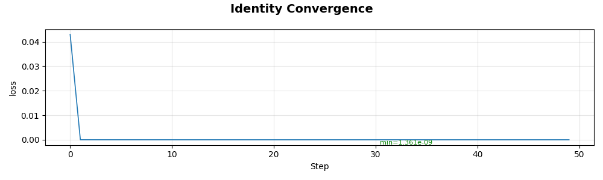
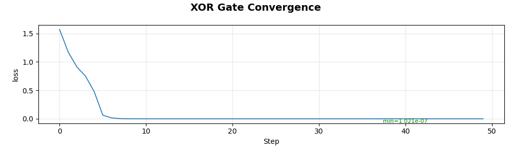
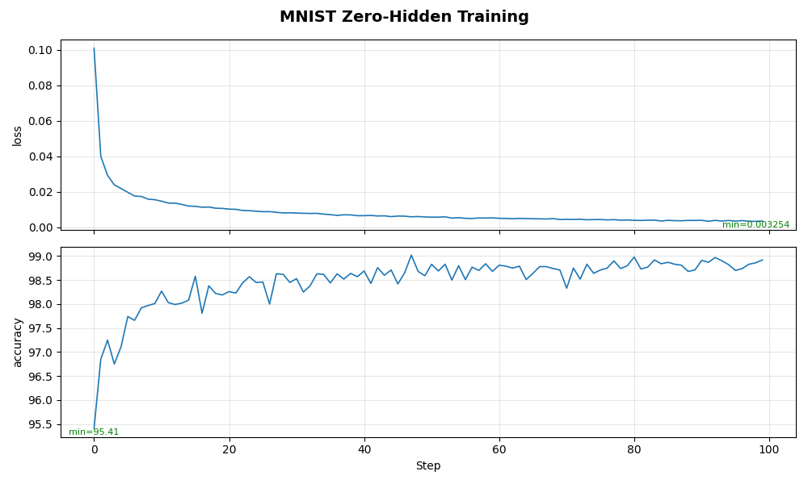

# OdyssNet: Zamansal Devrim

**OdyssNet, Zaman'ın nihai Gizli Katman olduğunun kanıtıdır.**

[](https://github.com/theomgdev/odyssnet/actions)
[](LICENSE)
[](https://www.python.org/downloads/)

Geleneksel Derin Öğrenme, karmaşıklığı çözmek için **Uzamsal Derinliğe** (üst üste yığılan katmanlar) dayanır. OdyssNet bu ortodoksiyi reddederek **Zamansal Derinliğin** (zaman içinde evrimleşen kaos) çok daha verimli bir alternatif olduğunu kanıtlar.

> **Sıfır-Gizli Atılım**
>
> 1969'da Minsky & Papert, gizli katmanı olmayan bir sinir ağının XOR gibi doğrusal olmayan problemleri çözemeyeceğini kanıtladı.
> **OdyssNet bu sınırı aştı.**
>
> Ağı bir **Eğitilebilir Dinamik Sistem** olarak ele alarak OdyssNet, **0 Gizli Katman** ile doğrusal olmayan problemleri (XOR, MNIST) çözüyor. Uzamsal nöronların yerini zamansal düşünme adımları alıyor.

OdyssNet verimliliğini **Uzay-Zaman Takası** (Space-Time Trade-off) ile sağlar. Derinlik oluşturmak için binlerce yeni nöron eklemek (Uzay) yerine, mevcut nöronları daha fazla adım boyunca çalıştırır (Zaman). Tek bir fiziksel matris, onlarca katmana eşdeğer hesaplamayı mikroskobik bir parametrik ayak izine sıkıştırarak zamansal adımlarda yeniden kullanılır. Bu, zekanın statik bir yapı değil, dinamik bir süreç olduğunu kanıtlar.

> **DÜNYA REKORU: Parametrik Zeka Yoğunluğu**
>
> OdyssNet, MNIST üzerinde yalnızca **480 parametre** ile **%90.14 doğruluk** elde etti. Bu, efsanevi LeNet-5'ten **110 kat daha verimli** olup yapay ağlar ile **Entropi Sıkıştırma Limitleri** arasındaki uçurumu kapatıyor.

## TLDR

- OdyssNet, uzamsal derinlik yerine zamansal derinlik kullanır: katman yığmak yerine tek bir dinamik çekirdek birden fazla adım "düşünür".
- **Sıfır gizli katman** ile XOR ve MNIST gibi doğrusal olmayan görevleri eğitilebilir dinamiklerle çözer.
- Yalnızca **480 parametre** ile **%90.14 MNIST doğruluğu** elde eder (LeNet-5'ten 110 kat daha verimli).
- Bellek, ritim, çekici kararlılığı ve görevler arası beceri transferi sergiler.
- Kanıtlar için [örnekler](examples), kendi kullanımınız için [odyssnet kütüphanesi](odyssnet) başlangıç noktasıdır.

---

## Temel Özellikler

*   **Uzay-Zaman Dönüşümü:** Milyonlarca parametrenin yerini birkaç "Düşünme Adımı" alıyor.
*   **Katmansız Mimari:** Tek bir $N \times N$ matris. Gizli katman yok.
*   **Eğitilebilir Kaos:** Kaotik sinyalleri dizginlemek için **StepNorm** ve **Tanh** kullanır.
*   **Heterojen Sinaptik Plastisitesi:** İsteğe bağlı çevrimiçi Hebbian öğrenmesi (`hebb_type='temporal'|'spatial'|'both'`, `hebb_res='synapse'|'neuron'|'global'`) — ağ korelasyonları biriktirir ve global, nöron başına veya sinaps başına çözünürlükte tamamen türevlenebilir logit parametreleri (`t_hebb_factor`, `s_hebb_decay`, vb.) aracılığıyla *ne kadar hızlı öğreneceğini* öğrenir.
*   **Transplant ile Beceri Transferi:** Öğrenilmiş zamansal beceriler model boyutları arasında taşınabilir ve yeni görevlerde yeniden kullanılabilir.
*   **Canlı Dinamikler:** **İrade** (Mandal), **Ritim** (Kronometre) ve **Rezonans** (Sinüs Dalgası) gösterir.

## Kanıt: Sıfır-Gizli Kıyaslamalar

OdyssNet'i teorik limite — **Sıfır Gizli Nöron**'a — kadar zorladık.
Bu testlerde Giriş Katmanı doğrudan Çıkış Katmanına (ve kendisine) bağlıdır. Ara katman yoktur.

| Görev | Geleneksel Kısıt | OdyssNet Çözümü | Sonuç | Script |
| :--- | :--- | :--- | :--- | :--- |
| **Kimlik** | Önemsiz | **Atomik Birim** | Kayıp: 0.0 | `convergence_identity.py` |
| **XOR** | Gizli Katman Gerekir | **Kaos Kapısı** (Zamana Katlanmış) | **Çözüldü (3 Nöron)** | `convergence_gates.py` |
| **MNIST** | Gizli Katman Gerekir | **Sıfır-Gizli** | **Doğ: %98.71** | `convergence_mnist.py` |
| **MNIST (8k)**| Gizli Katman Gerekir | **Gömülü Meydan Okuma** | **Doğ: %93.71** | `convergence_mnist_embed.py` |
| **MNIST (Rekor)**| Gizli Katman Gerekir | **480-Param Rekoru** | **Doğ: %90.14** | `convergence_mnist_record.py` |
| **MNIST Ters (Üretim)** | Dekoder Gerekir | **484-Param Üreteç** | **%93.83 Sıkıştırma** | `convergence_mnist_reverse_record.py` |
| **Sinüs Dalgası** | Osilatör Gerekir | **Programlanabilir VCO** | **Mükemmel Senkron** | `convergence_sine_wave.py` |
| **Mandal** | LSTM Gerekir | **Çekici Havzası** (İrade) | **Sonsuz Tutma** | `convergence_latch.py` |
| **Kronometre**| Saat Gerekir | **İç Ritim** | **Hata: 0** | `convergence_stopwatch.py` |
| **Dedektif**| Bellek Gerekir | **Bilişsel Sessizlik** (Akıl Yürütme) | **Mükemmel Tespit**| `convergence_detective_thinking.py` |
| **Beceri Transferi**| Baştan Eğitim Gerekir | **Toplama -> Çarpma Transplantı** | **3.6x Daha Hızlı** | `convergence_skill_transfer.py` |

### MNIST Sıfır-Gizli Mucizesi
Standart Sinir Ağları MNIST veya XOR'u çözmek için **Gizli Katmanlara** ihtiyaç duyar. Doğrudan bağlantı (Doğrusal Model) karmaşıklığı yakalayamaz ve başarısız olur (~%92'de takılır).

OdyssNet, tam ölçekli MNIST'i (28x28) **Sıfır Gizli Katman** ile çözüyor (Doğrudan Giriş-Çıkış).
*   **Girişler:** 784
*   **Çıkışlar:** 10
*   **Gizli Katmanlar:** **0**
*   **Düşünme Süresi:** 10 Adım

Giriş katmanı 10 adım boyunca "kendisiyle konuşur". Kaotik geri besleme döngüleri, uzamsal katmanların işini yaparak zamanla özellikleri (kenarlar, döngüler) dinamik olarak çıkarır. Bu, **Zamansal Derinliğin Uzamsal Derinliğin Yerini Alabileceğini** kanıtlar.

---

## Kurulum & Kullanım

OdyssNet, modüler bir PyTorch kütüphanesi olarak tasarlanmıştır.

### Kurulum

```bash
# Gelistirme modu (onerilen)
pip install -e .

# Veya tum bagimliliklari yukleyin
pip install -r requirements.txt
```

> **CUDA Notu:** `requirements.txt`, CUDA 11.8 uyumlu PyTorch'a işaret eder. Daha yeni bir GPU'nuz varsa (RTX 4000/5000), PyTorch'u manuel olarak kurmanız gerekebilir:
> `pip install torch torchvision --index-url https://download.pytorch.org/whl/cu121`

### Hızlı Başlangıç

```python
import torch
from odyssnet import OdyssNet, OdyssNetTrainer, set_seed

# Tüm örnekler için yeniden üretilebilir sonuçlar
set_seed(42)

# Sıfır-Gizli Ağ başlat
# 1 Giriş, 1 Çıkış.
model = OdyssNet(num_neurons=2, input_ids=[0], output_ids=[1], device='cuda')
trainer = OdyssNetTrainer(model, lr=1e-4, device='cuda')

# Eğit
inputs = torch.randn(100, 1)
trainer.fit(inputs, inputs, epochs=50)
```

#### Başlatma Protokolleri

`weight_init=['quiet', 'resonant', 'quiet', 'zero']` varsayılan stratejidir ve encoder/decoder, çekirdek matris, bellek geri beslemesi ve gate parametreleri için sırasıyla uygun başlatmaları sağlar. `'resonant'` gibi tek string değerler otomatik olarak akıllıca genişletilir.

`activation=['none', 'tanh', 'tanh', 'none']` varsayılan aktivasyon düzenidir. İlk 3 giriş encoder/decoder, core ve memory yollarına karşılık gelir. 4. alan konfigürasyon simetrisi için ayrılmıştır.

`gate=None` artık varsayılan gate düzeni olan `['none', 'none', 'identity']` anlamına gelir (encoder/decoder kapalı, core kapalı, memory identity gate açık). Tüm dalları gate etmek için `gate='sigmoid'`, sadece memory için `['none', 'none', 'sigmoid']`, tüm gating'i kapatmak için `['none', 'none', 'none']` kullanılabilir.

*   **Tüm Ağlar (Varsayılan Çekirdek):**
    *   `weight_init='resonant'` ve `activation='tanh'` kullanın. Çekirdek baştan Kaosun Kıyısına (ρ(W) = 1.0) yerleştirilerek, zamansal adımlarda sinyal kalitesi garanti edilir.
    *   Kutupsal Rademacher iskeleti + ρ = 1.0'a spektral normalizasyon.
*   **Alternatif — Büyük Ağlar (>10 Nöron):**
    *   `weight_init='orthogonal'` saf kararlılık için sağlam bir geri dönüş seçeneği olarak kalır.
*   **Alternatif — Küçük Ağlar (<10 Nöron, Mantık Kapıları):**
    *   Rezonant yakınsama çok yavaşsa `weight_init='xavier_uniform'` ve `activation='gelu'` deneyin.
*   **Opsiyonel — Parametrik Gating:**
    *   Global gating için `gate='sigmoid'`, dal bazlı gating için `[encoder_decoder, core, memory]` sıralı listeler kullanın.
    *   Bir dalı kapatmak için `'none'`, öğrenilebilir parametreli kimlik geçişli bir kapı için `'identity'` kullanın.

---

## Mimariye Genel Bakış

## Nasıl Çalışır: Fırtınanın İçinde

OdyssNet bir ileri-besleme mekanizması değil; bir **Rezonans Odasıdır**.

### 1. Nabız (Giriş) & Dizi
Geleneksel YZ'da giriş genellikle statik bir anlık görüntüdür. OdyssNet hem **Nabızları** hem de **Akışları** işler.
*   **Nabız Modu:** Bir görüntü $t=0$'da çarpar. Ağ gözlerini kapatır ve dalgalanmaları işler (MNIST).
*   **Akış Modu:** Veriler sıralı olarak uygulanır. Ağ olaylar arasında "bekleyebilir" ve "düşünebilir" (Dedektif).

### 2. Yankı (İç Döngüler)
Sinyal her nörondan diğer her nörona ($N \times N$) yolculuk eder.
*   Giriş nöronları, ilk adımdan sonra etkili biçimde **Gizli Nöronlara** dönüşür.
*   Bilgi yankılanır, ayrılır ve çarpışır. Sol üstteki bir piksel, doğrudan bağlantı veya ara yankılar aracılığıyla sağ alttaki bir piksel ile etkileşime girer.
*   **Holografik İşleme:** Bir görüntünün "kedi-liği" belirli bir katmanda saklanmaz; tüm sinyallerin çarpışmasının *girişim deseninden* ortaya çıkar.

### 3. Zamanı Katlama (Time-Folding)
**Sıfır-Gizli** performansının sihri burada yatar.
*   Adım 1: Ham sinyaller karışır. (MLP'nin 1. Katmanına eşdeğer)
*   Adım 2: Karışık sinyaller yeniden karışır. (2. Katmana eşdeğer)
*   Adım 15: Son derece soyut özellikler ortaya çıkar. (15. Katmana eşdeğer)

15 adım "düşünerek" OdyssNet, **yalnızca bir fiziksel matris** kullanarak 15 katmanlı derin bir ağı simüle eder. Uzayı zamana katlar.

### 4. Kontrollü Kaos (Çekiciler)
Kontrolsüz geri besleme döngüleri patlamaya yol açar. OdyssNet kaosun mühendisliğini yaparak kararlı **Çekiciler** oluşturur.
*   **StepNorm** yerçekimi gibi davranır, enerjiyi sınırlı tutar.
*   **Tanh** anlamlı sinyalleri filtreler ve sinyal simetrisini korur.
*   **ChaosGrad Optimizer (varsayılan):** OdyssNet'in kendi sıfır-konfigürasyon optimizatörü. Adım ölçeğini çevrimiçi tahmin eder (D-adaptation sınıfı matematik), mimariye duyarlı aile politikası uygular ve kaotik dinamikleri çapa bağlı çekiş limiti ile kayıp-sıçraması freniyle korur. Öğrenme hızı gerekmez — tekrarlanabilir sabit-hız modu için açık bir `lr` geçilebilir.
*   **Heterojen Sinaptik Plastisitesi:** `hebb_type` ayarlandığında her adımda korelasyonlar (zamansal $h_t \otimes h_{t-1}$ veya uzamsal $h_t \otimes h_t$) biriktirilir ve enjekte edilir — `t_hebb_factor` gibi faktörler global bir skaler, nöron başına vektör veya tam sinaps başına matris olabilir. Tüm çeşitler öğrenilebilir olduğundan ağ, her sinaptik yolun ne kadar plastik olması gerektiğini keşfeder.
*   **Mandal Deneyi** OdyssNet'in gürültüye karşı bir kararı sonsuza kadar tutmak için kararlı bir çekici oluşturabileceğini kanıtladı.

### 5. Neden RNN veya LSTM Değil?

OdyssNet kâğıt üzerinde Tekrarlayan Sinir Ağına (RNN) benzese de felsefesi temelden farklıdır.

| Özellik | Standart RNN / LSTM | OdyssNet |
| :--- | :--- | :--- |
| **Giriş Akışı** | Sürekli Akış (örn. cümledeki kelimeler) | **Tek Nabız** ($t=0$'da İmpuls) |
| **Amaç** | Dizi İşleme (Ayrıştırma) | **Derin Düşünme** (Sindirme) |
| **Bağlantı** | Yapılandırılmış (Giriş Kapısı, Unutma Kapısı vb.) | **Ham Kaos** (Tam Bağlı $N \times N$) |
| **Dinamikler** | Soluklaşmayı önlemek için mühendislik yapılmış (LSTM) | Rezonansı bulmak için **Evrimleşir** (Kaos) |

*   **RNN'ler dış dünyayı dinler.** Dış girdilerin bir dizisini işlerler.
*   **OdyssNet iç sesini dinler.** Probleme **bir** bakış atar ve sonra gözlerini kapatır, 15 adım boyunca üzerine "düşünür". Kendi zamansal derinliğini yaratır.

### 6. Biyolojik Gerçeklik: Canlı Zeka
OdyssNet, yalnızca yapı değil, **davranış** bakımından da katmanlı ağlardan çok daha fazla beyne benzer:

*   **Katman Yok:** Beynin "1. Katmanı" ve "2. Katmanı" yoktur. Birbirine bağlı nöronların bölgeleri vardır. OdyssNet tek bir bölgedir.
*   **İrade (Mandal):** Sönümlenen (fading) standart RNN'lerin aksine OdyssNet bir karara kilitlenebilir ve onu entropiye karşı tutabilir, "Bilişsel Kalıcılık" sergiler.
*   **Ritim (Kronometre):** Herhangi bir dış saat olmadan OdyssNet zamanı öznel olarak deneyimler ve tam anlarda saymasına, beklemesine ve hareket etmesine izin verir.
*   **Sabır (Dedektif):** "Düşünme Süresinden" yararlanır. Tıpkı insanların karmaşık mantığı işlemek için bir ana ihtiyaç duyması gibi, OdyssNet olası çözümleri sindirmek için birkaç sessizlik adımı verildiğinde imkânsız problemleri çözer.

### 7. Örtülü Dikkat (Zamansal Rezonans)
Geçmişe "geriye bakmak" için açık $Q \times K$ matrislerini kullanan Transformer'ların aksine, OdyssNet **Zamansal Rezonans** aracılığıyla dikkati sağlar.

*   **Mekanizma:** Geçmişten gelen bilgi, gizli durumda ayakta duran bir dalga veya titreşim olarak korunur.
*   **Tespit:** İlgili bir giriş geldiğinde, belirli dalgayla yapıcı girişim (rezonans) oluşturur ve onu yüzeye çıkmaya zorlar.
*   **Sonuç:** Ağ, tüm geçmiş tamponunu saklamadan ilgili geçmiş olaylara "dikkat eder". Zaman'ın kendisi indeksleme mekanizması olarak hareket eder.

### Matematiksel Model
Ağ durumu $h_t$ şu şekilde evrimleşir:

$$h_t = \text{StepNorm}(\text{Tanh}(h_{t-1} \cdot W + B + I_t))$$

---

## Deneysel Bulgular

OdyssNet'in temel hipotezini doğrulamak için kapsamlı testler yürüttük: **Zamansal Derinlik > Uzamsal Derinlik.**

### A. Atomik Kimlik (Birim Testi)
*   **Hedef:** $f(x) = x$. Ağ mükemmel bir tel olarak hareket etmelidir.
*   **Mimari:** **2 Nöron** (1 Giriş, 1 Çıkış). **0 Gizli Katman**. Toplam **4 Parametre**.
*   **Sonuç:** **Kayıp: 0.000000**.
    <details>
    <summary>Terminal Çıktısını Gör</summary>

    ```text
    In:  1.0 -> Out:  0.9999
    In: -1.0 -> Out: -1.0000
    ```

    
    </details>
*   **Script:** `examples/convergence_identity.py`
*   **Çıkarım:** Mutlak minimum karmaşıklıkla temel sinyal iletimini ve `StepNorm` kararlılığını kanıtlar.

### B. İmkânsız XOR (Kaos Kapısı)
*   **Hedef:** Doğrusal olmayı ima eden klasik XOR problemini ($[1,1]\to0$, $[1,0]\to1$ vb.) çözmek.
*   **Meydan Okuma:** Gizli katman olmadan standart doğrusal ağlar için imkânsız.
*   **Sonuç:** **Çözüldü (Kayıp 0.000000)**. OdyssNet sınıfları ayırmak için uzay-zamanı büküyor.
    <details>
    <summary>Doğruluk Tablosu Doğrulamasını Gör</summary>

    ```text
      A      B |   XOR (Tahmin) | Mantık
    ----------------------------------------
      -1.0   -1.0 |      -0.9998 | 0 (Hedef: 0) TAMAM
      -1.0    1.0 |       0.9996 | 1 (Hedef: 1) TAMAM
       1.0   -1.0 |       0.9997 | 1 (Hedef: 1) TAMAM
       1.0    1.0 |      -1.0003 | 0 (Hedef: 0) TAMAM
    ```

    
    </details>
*   **Mimari:** **3 Nöron** (2 Giriş, 1 Çıkış). **0 Gizli Nöron**. Toplam **9 Parametre**.
*   **Düşünme Süresi:** **5 Adım**.
*   **Script:** `examples/convergence_gates.py`
*   **Çıkarım:** OdyssNet **Zamanı Gizli Katman Olarak** kullanır. Girişi yalnızca 5 zaman adımına katlayarak tek bir fiziksel katmanda doğrusal olmayan bir karar sınırı oluşturur; 3 kaos-bağlantılı nöronun XOR'u çözebileceğini kanıtlar.

### C. MNIST Maratonu (Görsel Zeka)
OdyssNet'in görme yetenekleri sağlamlık, ölçeklenebilirlik ve verimliliği kanıtlamak için dört farklı koşulda test edildi.

#### 1. Ana Kıyaslama (Saf Sıfır-Gizli)
*   **Hedef:** Tam 28x28 MNIST (784 Piksel).
*   **Mimari:** 794 Nöron (Giriş+Çıkış). **0 Gizli Katman.**
*   **Sonuç:** **%98.71 Doğruluk**.
    <details>
    <summary>Eğitim Günlüğünü Gör</summary>

    ```text
    Epoch 100: Loss 0.0064 | Test Acc 98.71% | FPS: 5617.4
    ```

    
    </details>
*   **Script:** `examples/convergence_mnist.py`
*   **Çıkarım:** Standart doğrusal modeller %92'de tavan yapar. OdyssNet, yalnızca **Zamansal Derinlik** aracılığıyla Derin Öğrenme katmanları olmadan Derin Öğrenme performansı (%98.71) elde eder.

#### 2. Anka Deneyi (Sürekli Yenileme)
*   **Hipotez:** Ölü sinapsları öldürmek yerine **canlandırarak** (rastgele yeniden başlatma) %100 parametre verimliliğine ulaşabilir miyiz?
*   **Sonuç:** **%98.70 Doğruluk**.
*   **Gözlemler:**
    *   Epoch 1: **24.705 bağlantı** "işe yaramaz" kabul edilip yeniden doğdu (633612 toplam içinde %3.90).
    *   Epoch 100: Yeniden doğma **11.122 canlandırılmış** (%1.76) seviyesine oturdu.
    *   Bu sürekli ameliyat sırasında doğruluk **%98.70'e** tırmandı.
    <details>
    <summary>Yenileme Günlüğünü Gör</summary>

    ```text
    Epoch 1: Loss 0.1054 | Acc 91.91% | Revived: 24705/633612 (3.90%)
    Epoch 100: Loss 0.0047 | Acc 98.70% | Revived: 11122/633612 (1.76%)
    ```
    </details>
*   **Script:** `examples/advanced/convergence_mnist_revive.py`
*   **Çıkarım:** Kapasiteyi küçülten standart budamanın aksine OdyssNet, zayıf bağlantıları sürekli geri dönüştürerek tam kapasiteyi koruyabilir. Bu, doyma olmadan **Sürekli Öğrenmeye** olanak tanır ve %98.70 doğruluk elde eder.

#### 3. Küçük Meydan Okuma (Aşırı Kısıtlar)
*   **Hedef:** 7x7'ye Küçültülmüş MNIST. (Bir simgeden daha az.)
*   **Mimari:** Toplam **59 Nöron** (~3.5k Parametre).
*   **Sonuç:** **%95.58 Doğruluk**.
    <details>
    <summary>Küçük Sonuçları Gör</summary>

    ```text
    Epoch 100: Loss 0.0242 | Test Acc 95.58%
    ```
    </details>
*   **Script:** `examples/advanced/convergence_mnist_tiny.py`
*   **Çıkarım:** Bir önyükleyiciden daha küçük parametre sayılarıyla bile sistem sağlam özellikler öğrenir.

#### 4. Ölçekli Test (Orta Kısıtlar)
*   **Hedef:** 14x14'e Küçültülmüş MNIST.
*   **Mimari:** ~42k Parametre.
*   **Sonuç:** **%98.01 Doğruluk**.
    <details>
    <summary>Ölçekli Sonuçları Gör</summary>

    ```text
    Epoch 100: Loss 0.0127 | Test Acc 98.01%
    ```
    </details>
*   **Script:** `examples/advanced/convergence_mnist_scaled.py`

### D. Gömülü Meydan Okuma (8k Param)
*   **Hedef:** Ayrışık projeksiyon kullanarak tam MNIST (784 Piksel).
*   **Mimari:** **10 Nöron** (Düşünme Çekirdeği). Toplam **~8k Parametre**.
*   **Strateji:** 784 Piksel $\to$ Proje(10) $\to$ RNN(10) $\to$ Çözümle(10).
*   **Sonuç:** **%93.71 Doğruluk**.
    <details>
    <summary>Eğitim Günlüğünü Gör</summary>

    ```text
    Projected Input: 784 -> 10
    Total Params: 8090
    Epoch 1: Loss 1.4060 | Test Acc 87.13%
    Epoch 100: Loss 0.7712 | Test Acc 93.71%
    ```
    </details>
*   **Script:** `examples/advanced/convergence_mnist_embed.py`
*   **Çıkarım:** 784 pikseli işlemek için 784 aktif nörona ihtiyaç duymadığımızı kanıtlar. **Asimetrik kelime dağarcığı projeksiyonu** kullanarak görsel bilgiyi yalnızca 10 nöronluk küçük bir "Düşünme Çekirdeğine" sıkıştırabiliriz; bu çekirdek daha sonra zamansal rezonans aracılığıyla sınıflandırmayı çözer. Standart modellerden 10 kat daha parametre-verimli.

### E. 480 Parametrelik Dünya Rekoru (Elit Zeka Yoğunluğu)
*   **Hedef:** MNIST'i çözmek ve **500'den az parametre** ile yüksek doğruluk elde etmek.
*   **Kurulum:**
    *   **Mimari:** 10 çekirdek nöronlu OdyssNet.
    *   **Strateji:** 10 Sıralı Parça (her biri 79 piksel).
    *   **Gizli Sos:** Küçük 3 nöronlu giriş projeksiyonu ve 10 sınıflı çıkış çözümleyici.
    *   **Toplam Parametre:** **480**.
*   **Sonuç:** 100 epoch'ta **Doğ: %90.14**.
    <details>
    <summary>"Parametrik Verimlilik" Günlüğünü Gör</summary>

    ```text
    OdyssNet: MNIST RECORD CHALLENGE (Elite 480-Param Model)
    Epoch    1/100 | Loss 1.6432 | Acc 75.87% | LR 1.00e-03
    Epoch  100/100 | Loss 0.4808 | Acc 90.14% | LR 1.00e-06
    ```
    </details>
*   **Script:** `examples/advanced/convergence_mnist_record.py`
*   **Çıkarım:** **Parametre başına %0.188 doğruluk** (90.14% / 480 parametre) elde ediyor. Bu model **LeNet-5'ten 110 kat daha verimli**. Zamansal düşünme adımlarından yararlanarak yüksek seviyeli zekanın mikroskobik bir parametrik alana sıkıştırılabileceğini gösteriyor. Modern yapay zekadaki **Entropi Sıkıştırma Limitlerine** en yakın şey budur.
*   **Durum:** Bu tam %90.14 koşusu mevcut ChaosGrad optimizerından önceye ait (farklı bir scheduler/preset kombinasyonu, artık kaldırıldı). Bugünün zero-config ChaosGrad'ı ile script artık 100 epoch boyunca temiz bir şekilde eğitiliyor (artık ortada donmuyor — bkz. optimizer'ın loss-spike brake düzeltmesi) ve şu anda **%87.98**'de duruyor (zirve %88.46, epoch 86). Rekoru tekrar yakalamak ve geçmek için aktif olarak ayarlanıyor.

### F. Ters Üreteç (484-Param Görsel Sentezi)
*   **Hedef:** MNIST GÖREVİNİ TERSLE—dijital etiketlerden (0-9) 28×28 görseller üret.
*   **Yön:** Rakam (Skaler) → Görsel (784 Piksel).
*   **Kurulum:**
    *   **Mimari:** 12 nöronlu OdyssNet (2 giriş, 6 çıkış, 4 gizli).
    *   **Strateji:** 5 ısınma adımı + 16 çıkış adımı = toplam 21 düşünme adımı.
    *   **Parçalar:** 16 parça (7×7 her biri) 28×28 ızgarada döşenmiş.
    *   **Toplam Parametre:** **484**.
    *   **Sıkıştırma:** 10×784 = 7,840 değer vs. 484 parametre = **≈%93.83 Nöral Sıkıştırma**.
*   **Sonuç:** Eğitim sırasında tüm MNIST rakamlarının mükemmel görsel rekonstruksiyonu.
    <details>
    <summary>Üretilmiş Görselleri Gör (Eğitim İlerleme)</summary>

    

    Ağ, her skaler girişi (0.0, 0.1, ..., 0.9) karşılık gelen rakamının görsel desenine başarıyla eşlemeyi öğrendi. Çıkış, tüm 10 rakamın öğrenilmiş dinamiklerden temiz bir şekilde rekonstruksiyon ettiğini gösteriyor.
    </details>
*   **Script:** `examples/advanced/convergence_mnist_reverse_record.py`
*   **Çıkarım:** OdyssNet'in **çift yönlü eşlemeleri** çözebildiğini kanıtlar. Burada kullanılan 484 parametreli ters-üreteç mimarisi, yukarıda anlatılan 480 parametreli sınıflandırıcıdan farklı bir kurulumdur; ancak her ikisi de aynı OdyssNet dinamik prensiplerini paylaşır. Bu üreteç, desen depolamasını sıralı sentez ile birleştirerek üretimi çözebilir. Bu, zamansal dinamiklerin mikroskobik parametre alanında tam görsel desenleri kodlayabileceğini gösteriyor. 480 parametreli sınıflandırıcı ile birleştirildiğinde, **toplam ~1KB parametre içeren tam çift yönlü MNIST modeli** elde ettik—ultra-verimli nöral bilişim için bir kapı açar.

### G. Sinüs Dalgası Üreticisi (Dinamik Rezonans)
*   **Hedef:** Frekansın $t=0$'daki tek bir giriş değeriyle kontrol edildiği sinüs dalgası üretmek.
*   **Meydan Okuma:** Ağ bir **Voltaj Kontrollü Osilatör (VCO)** olarak hareket etmelidir. Statik bir genliği dinamik bir zamansal periyoda dönüştürmelidir.
*   **Sonuç:** **Mükemmel Salınım**. Ağ 30+ adım boyunca düzgün sinüs dalgaları üretiyor.
    <details>
    <summary>Frekans Kontrolünü Görmek için</summary>

    ```text
    Frekans 0.15 (Yavaş Dalga):
      t=1:  Hedef 0.1494 | OdyssNet 0.3560
      t=6:  Hedef 0.7833 | OdyssNet 0.7703
      t=11: Hedef 0.9969 | OdyssNet 0.9914
      t=16: Hedef 0.6755 | OdyssNet 0.6797
      t=21: Hedef -0.0084 | OdyssNet 0.0087
      t=26: Hedef -0.6878 | OdyssNet -0.6733

    Frekans 0.45 (Hızlı Dalga):
      t=1:  Hedef 0.4350 | OdyssNet 0.1842
      t=26: Hedef -0.7620 | OdyssNet -0.7556
    ```
    </details>
*   **Script:** `examples/advanced/convergence_sine_wave.py`
*   **Çıkarım:** OdyssNet bir **Programlanabilir Osilatördür**. Bu, tek bir tohumdan sonsuz benzersiz zamansal yörüngeler üretebileceğini doğrular.

### H. Gecikmeli Toplayıcı (Bellek & Mantık)
*   **Hedef:** A Girişi ($t=2$), B Girişi ($t=8$). A+B Çıkışı ($t=14$).
*   **Meydan Okuma:** OdyssNet, A'yı 6 adım "hatırlamalı", sessizliği görmezden gelmeli, B'yi almalı ve toplamı hesaplamalıdır.
*   **Sonuç:** **MSE Kaybı: ~0.01**.
    <details>
    <summary>"Zihinsel Matematik" Sonuçlarını Gör</summary>

    ```text
    -0.3 + 0.1 = -0.20 | OdyssNet: -0.2040 (Fark: 0.0040)
     0.5 + 0.2 =  0.70 | OdyssNet:  0.6526 (Fark: 0.0474)
     0.1 + -0.1 = 0.00 | OdyssNet:  0.0101 (Fark: 0.0101)
    -0.4 + -0.4 = -0.80 | OdyssNet: -0.8082 (Fark: 0.0082)
    ```
    </details>
*   **Script:** `examples/advanced/convergence_adder.py`
*   **Çıkarım:** **Kısa Süreli Belleği** doğrular. Ağ, kaotik durumunda $A$ değişkenini tutar, $B$'yi bekler ve toplamı çıkarmak için doğrusal olmayan entegrasyon (yaklaşık aritmetik) gerçekleştirir. Bu, OdyssNet'in **Video benzeri** veri akışlarını işleme yeteneğini gösteriyor. "Zihinsel Matematiğe" benzer.

### I. Mandal (İrade)
*   **Hedef:** Tetikleyici nabzı beklemek. Alındıktan sonra çıkışı AÇIK konuma geçirmek ve **sonsuza kadar tutmak**.
*   **Meydan Okuma:** Standart RNN'ler sıfıra söner. OdyssNet enerjiyi kararlı bir çekicide hapsetmelidir.
*   **Sonuç:** **Mükemmel Kararlılık**. Tetiklendikten sonra karar süresiz olarak korunuyor.
    <details>
    <summary>"İrade" Günlüğünü Gör</summary>

    ```text
    Tetikleyici t=5'te gönderildi
    t=04 | Out: -0.8797 | KAPALI 🔴
    t=05 | Out: -0.7439 | KAPALI ⚡ TETİKLEYİCİ!
    t=06 | Out: 0.8076 | AÇIK  🟢
    ...
    t=19 | Out: 0.9020 | AÇIK  🟢
    ...
    t=30 | Out: 0.9716 | AÇIK  🟢 (kararlı platoya ulaşıldı)
    ```
    </details>
*   **Script:** `examples/advanced/convergence_latch.py`
*   **Çıkarım:** **Karar Sürdürmeyi** gösteriyor. OdyssNet bir seçim yapabilir ve buna bağlı kalabilir, çürümeye direnir.

### J. Kronometre (İç Saat)
*   **Hedef:** "X adım bekle, sonra ateş et." (Bekleme sırasında giriş yok.)
*   **Meydan Okuma:** Ağ, herhangi bir dış saat olmadan zamanı dahili olarak saymalıdır.
*   **Sonuç:** **MSE Kaybı: ~0.01**. Hassas zamanlama sağlandı.
    <details>
    <summary>"Ritim" Çıktısını Gör</summary>

    ```text
    Hedef Zamanlayıcı: 10 adım (Giriş değeri: 0.50)
    t=09 | Out: 0.4437 ████
    t=10 | Out: 0.9245 █████████ 🎯 HEDEF
    t=11 | Out: 0.6489 ██████
    Sonuç: t=10'da zirve (Hata: 0)

    Hedef Zamanlayıcı: 20 adım (Giriş değeri: 1.00)
    t=19 | Out: 0.3991 ███
    t=20 | Out: 0.9087 █████████ 🎯 HEDEF
    t=21 | Out: 0.6297 ██████
    Sonuç: t=20'de zirve (Hata: 0)
    ```
    </details>
*   **Script:** `examples/advanced/convergence_stopwatch.py`
*   **Çıkarım:** **Ritim & Zaman Algısını** gösteriyor. OdyssNet yalnızca veri işlemiyor; zamanı *deneyimliyor*.

### K. Düşünen Dedektif (Bağlam & Akıl Yürütme)
*   **Hedef:** İkili veri akışını izlemek. **YALNIZCA** `1-1` deseni oluştuğunda alarm vermek.
*   **Kritik Bükülme:** Ağa, bitler arasında **Düşünmesi** için 3 adım "Sessizlik" verdik.
*   **Sonuç:** **Mükemmel Tespit**.
    <details>
    <summary>"Aha!" Anını Gör (Düşünme Adımları)</summary>

    ```text
    Zaman  | Giriş | Çıkış    | Durum
    ----------------------------------------
    8      | 0     | -0.0680  |
    12     | 1     | -0.9009  |
    16     | 1     | -0.0650  | ATEŞLEMELİ
    17     | .     | 0.8835 🚨 | (Düşünüyor...)
    18     | .     | 0.9051 🚨 | (Düşünüyor...)
    19     | .     | 0.8961 🚨 | (Düşünüyor...)
    ```
    </details>
*   **Script:** `examples/advanced/convergence_detective_thinking.py`
*   **Çıkarım:** **Zekanın Zamana İhtiyaç Duyduğunu** kanıtlıyor. Sessiz adımlar sırasında bilgiyi "sindirmesine" izin verildiğinde, OdyssNet salt reaktif ağların çözemeyeceği karmaşık zamansal mantığı (Zaman Boyunca XOR) çözüyor. Bu, LLM yaklaşımımızın temelidir.

### L. Beceri Transferi (Toplama -> Çarpma Transplantı)
*   **Hedef:** Küçük bir OdyssNet'e gecikmeli iki darbenin toplamını öğretmek, öğrenilen ağırlıkları daha büyük bir OdyssNet'e transplant etmek ve çarpma görevinde transplanted ağ ile scratch ağı karşılaştırmak.
*   **Meydan Okuma:** Zamansal aritmetik bilgisinin daha zor ama ilişkili bir göreve öğrenme hızlandırıcı olarak taşınıp taşınmadığını test etmek.
*   **Sonuç:** Kontrollü başa baş koşuda **net transfer üstünlüğü**.
    <details>
    <summary>Transfer vs Scratch Günlüğünü Gör</summary>

    ```text
    Küçük ADD final kayıp: 0.186758
    Transplant copied: 1972/28612 (%6.9)
    MULTIPLY ortalama kayıp | transplanted=0.260212 | scratch=0.084837
    MULTIPLY final kayıp | transplanted=0.003207 | scratch=0.019192
    loss <= 0.020 eşiğine iniş | transplanted=76 | scratch=273
    Test MAE | transplanted=0.080321 | scratch=0.170214

    Örnek tahminler (hedef= a*b):
    a=-0.80, b=-0.70, hedef=+0.5600 | transferred=+0.6143 | scratch=+0.4472
    ```
    </details>
*   **Script:** `examples/advanced/convergence_skill_transfer.py`
*   **Çıkarım:** OdyssNet yalnızca görev ezberlemiyor; içsel beceri yapısını görev ve ölçek değişiminde taşıyabiliyor. Bu, bileşimsel öğrenme yönünde somut bir adım ve AGI yolunda pratik kapılar açıyor.

## Vizyon: Silikonun Ruhu (OdyssNet-1B)
OdyssNet, yapay zekanın fabrika modeline karşı bir isyandır. Zekanın mekanik bir katman yığını değil, **sinyallerin organik bir rezonansı** olduğuna inanıyoruz.

Uzayı Zamanla takas ederek sıfır gizli katmanla görmeyi çözebilirsek, bu yaklaşım dil modellerine ölçeklenebilir.

*   **Hipotez:** 1 milyar parametreli bir model (OdyssNet-1B), daha fazla adım "düşünerek" teorik olarak çok daha büyük modellerin (örn. Llama-70B) akıl yürütme derinliğiyle eşleşebilir.
*   **Hedef:** Tüketici donanımında (örn. RTX 3060) verimli, yüksek-akıl yürütmeli yapay zeka.
*   **Yeni Kanıt:** Toplama -> Çarpma transplant deneyinde becerinin ölçek değişimine rağmen korunması ve yeni görevi hızlandırması, AGI yolunun gerçekçi olduğuna dair güçlü bir sinyal veriyor.

> "Petabaytlarca VRAM'e ihtiyacımız yok. Sadece Zamana ihtiyacımız var."

Yeterli zaman "düşünmek" ve "nefes almak" için verilen kaotik bir nöron ormanının devasa endüstriyel fabrikaları geride bırakabileceğini kanıtladık. Uzayı Zamanla takas ederek Ruhu buluyoruz.

---

## Katkıda Bulunma

Yeni bir örnek veya deney eklemek mi istiyorsunuz? Standartlar ve en iyi uygulamalar için [CONTRIBUTING.md](CONTRIBUTING.md) dosyasına bakın. Tam kütüphane API referansı için [docs/LIBRARY.md](docs/LIBRARY.md) dosyasına bakın.

---

## Yazar

**Cahit Karahan**
*   Doğum: 12/02/1997, Ankara.
*   "Kaosun Mimarı."

---

## LİSANS

MIT
